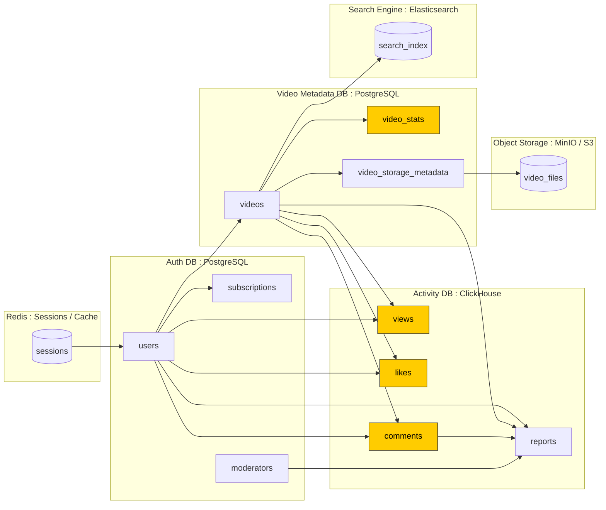

# VK-Education-Highload Курсовая работа
Шишкин А. Ю. WEB-41/31
# RUTUBE
## 1. Тема и Целевая Аудитория
**Тип сервиса**: Видеохостинг
**Местоположение целевой аудитории**: Россия и СНГ

### Основные страны пользователей
|Страна|% Пользователей|
|-|--------|
|Россия|93.3%|
|Казахстан|1.3%|
|Беларусь|1%|
|Украина|0.9%|
[Источник][3]

__Ключевой функционал__: Размещение видео

__Ключевое продуктовое решение__: Рекомендательная система видео

### MVP
* Авторизация
* Загрузка видео
* Просмотр видео (плеер)
* Просмотры и лайки
* Комментарии
* Админ-панель для модерации
* Рекомендации на главной 
* Поиск
* Главная Страница
* Страница автора

## 2. Расчёт нагрузки

### Предварительные данные
[**MAU**: 80M][1]

[**DAU**: 20M][1]

[4M каналов (зарегестрированных пользователей) всего][10]

**Средняя продолжительность визита: [46 минут][10]**

[**Средняя длина видео**: 12 минут][8]

3.8 Видео за посещение

[**Всего видео на площадке - 388М**][7]

1 минута видео весит 480мбит (0.48гб)(1080p, 30fps, 8Мбит/с битрейта).

Общий вес видео на рутубе на данный момент: 388М * 12 * 0.48 = **2 234 ПБ**

[421М Видео на площадке всего][5]

[33000М просмотров за полгода][5]

33000M / (6 * 30) = **183М / день** или **2К / секунда**

### RPS
| Тип запроса                                  |    Суточно  | Среднее RPS | Пиковое RPS (Среднее * 3) | Пояснение  |
| :------------------------------------------: | :-----------: | ----------: |        ----------:        | :----------:|
| **Просмотр видео**                           |          183M |         ~2K |          ~6K              |            |
| **Стриминг видео**                           |       131760M |       ~1.4M |          ~4.2M            | 2К запусков видео в секунду * 12*60 длительность видео в секундах, получается больно много, но по цифрам всё так будто |
| **Загрузка видео**                           |          370К |        ~4.3 |          ~13              | ~+135M видео за год => 135М/365 = 370K  |
| **Авторизация**                              |            4M |         ~47 |         ~141              | [4M каналов всего][10] |
| **Комментарии**                              |            1M |         ~12 |          ~36              | 1 коммент на 200 просмотров |
| **Главная Страница**                         |           20M |        ~231 |         ~696              | Каждый из DAU видит главную, хотя кто-то же заходит точечно по ссылке на видео... |
| **Профиль**                                  |           20K |        ~0.2 |         ~0.6              | В дальнейшем такие копейки игнорируем... |
| **Рекомендации**                             |          200M |       ~2.3K |          ~7K              | Каждый раз когда смотрят видео получают рекомендации + копейки с главной |
| **Лайки**                                    |            8M |         ~94 |         ~282              | 4 лайка на 100 просмотров |
| **Медиа (аватарки + превьюшки)**             |        2 745M |        ~32K |         ~96K              | На 1м экране просмотра видео умещается 8 рекомендованных видео, округлим до 10 и добавим 5 аватарок пользователей  |

### Трафик
| Тип трафика                                                           | Среднее (Гб/с) | Пиковое (Гб/c) | В сутки (ТБ) | Комментарий                      |
| --------------------------------------------------------------------- | -------------: | -------------: | ------------: | :------------------------------: |
| **Просмотр Видео**                                                    |            ~10 |            ~30 |      864     | 2000 видео/c * 0.005 мб          |
| **Стриминг Видео**                                                    |        ~10 400 |        ~31 200 |  624 000     | 1.4M RPS * 8мбит/c // чёт много              |
| **Загрузка Видео**                                                    |            ~25 |            ~75 |    6 480     | 4.3 * 12 мин * 0.48 гб/мин       |
| **Медиа**                                                             |            ~64 |           ~192 |   16 588     | 32K RPS * 2мб                    |
| **Итого**                                                             |      **~1507** |      **~4521** | **380 000**  |                                  |
 
### Хранилище
|Хранимый контент| Надо сейчас (ТБ) | Надо будет через год (ТБ) |Пояснение          |
|:--------------:|-----------------:|--------------------------:|:-----------------:|
|Видео           |        2 234 000 |                 3 041 280 | Чё так много то...|
|Медиа           |              850 |                      1190 |  4M * 2Мб (аватарки) + 421М * 2Мб (превьюхи) |
|Таблички (Просмотры, лайки, комменты)| | | Сущие копейки на фоне остального которые я даже не представляю как считать|

## 3. Глобальная балансировка нагрузки
### Функциональное разбиение по доменам
| Домен                                     | Назначение                                         |
| ----------------------------------------- | -------------------------------------------------- |
| **auth.rutube.ru**                        | Авторизация и управление сессиями                  |
| **upload.rutube.ru**                      | Загрузка видео и обработка                         |
| **video.rutube.ru**                       | Отдача видеопотока (плеер)                         |
| **api.rutube.ru**                         | Просмотры, лайки, комментарии, поиск, рекомендации |
| **admin.rutube.ru**                       | Админ-панель и модерация                           |
| **media.rutube.ru**                       | Превьюхи и аватарки                                |

### Обоснование расположения дата-центров

Москва — основной центр, большая часть аудитории в европейской части РФ.

Владивосток / Хабаровск — снижение задержек для Дальнего Востока.
### Расчет распределения запросов

### DNS

DNS-сервер не эффективен в пределах одной страны

### Anycast

Объявляем одинаковые ip в ДЦ Москвы и Дальнего востока, когда пользователь пытается подключиться к нашему сервису он подключается по ip, остальное дело за BGP который сам выберет ближайший к пользователю ДЦ

# 4. Локальная Балансировка

### Уровень 1 — L4 (Transport Layer, TCP/UDP)
Назначение: распределение трафика на уровне транспортного протокола между пулом серверов.  
Функции: балансировка по IP/портам, поддержка SSL passthrough (шифрование остаётся на серверах), высокая пропускная способность (network limit на узел 400–800 Гбит/с).  
Резервирование: N+1 активных балансировщиков. Формула расчёта резервирования: N_effective = (N * 2) / (N + 1).

### Уровень 2 — L7 (Application Layer, HTTP/HTTPS)
Назначение: распределение HTTP/HTTPS-запросов на уровне приложений.  
Функции: SSL Termination, балансировка по URL, cookies, headers, интеллектуальные алгоритмы (Least Connections, Weighted, Content-based routing).  
Резервирование: N+1 или Active/Passive, горячие резервы для отказоустойчивости. Пропускная способность узла: 10–40 Гбит/с с аппаратным ускорением SSL.

## 2. Расчёт количества балансировщиков

Дано: пиковая нагрузка 32 000 Гбит/с, L4 LB 500 Гбит/с на узел, L7 LB 30 Гбит/с на узел (SSL Termination).

Шаг 1 — L4: количество активных LB = 32 000 / 500 = 64.  
С резервированием N+1 → добавить 1 LB → всего 65 L4 LB.  
Каждый L4 LB — реальный физический узел, который может обрабатывать до 500 Гбит/с.

Шаг 2 — L7: количество активных LB = 32 000 / 30 ≈ 1067.  
С резервированием N+1 → добавить 1 LB → всего 1068 L7 LB.  
Для SSL Termination требуется большое количество узлов с аппаратным ускорением SSL.

# 5. Логическая схема БД

# 6 пункт какой он там

| Таблица                    | Назначение                       | Основные поля                                                                          | Индексы                                           | Шардирование               | СУБД               |
| -------------------------- | -------------------------------- | -------------------------------------------------------------------------------------- | ------------------------------------------------- | -------------------------- | ------------------ |
| **users**                  | Пользователи платформы           | `id`, `username`, `email`, `password_hash`, `created_at`                               | `username (UNIQUE)`, `email (UNIQUE)`             | Hash по `id`               | PostgreSQL (Auth)  |
| **subscriptions**          | Подписки между пользователями    | `subscriber_id`, `subscribed_to_id`, `created_at`                                      | Композитный (`subscriber_id`, `subscribed_to_id`) | нет                        | PostgreSQL (Auth)  |
| **moderators**             | Список модераторов и их роль     | `user_id`, `role`                                                                      | `user_id`                                         | нет                        | PostgreSQL (Auth)  |
| **videos**                 | Метаданные видео                 | `id`, `user_id`, `title`, `description`, `upload_date`, `duration`                     | `user_id`, GIN(`title`, `description`)            | Hash по `id`               | PostgreSQL (Video) |
| **video_storage_metadata** | Метаданные файлов в MinIO        | `video_id`, `bucket`, `object_key`, `resolution`, `format`, `checksum`                 | `video_id`, `bucket`                              | Hash по `bucket`           | PostgreSQL (Video) |
| **video_stats**            | Агрегаты просмотров/лайков       | `video_id`, `total_views`, `total_likes`, `updated_at`                                 | `video_id (UNIQUE)`                               | Hash по `video_id`         | PostgreSQL (Video) |
| **search_index**           | Поисковый индекс видео           | `video_id`, `keywords`, `tags`, `search_vector`                                        | GIN по `search_vector`                            | нет                        | PostgreSQL (Video) |
| **views**                  | История просмотров               | `video_id`, `user_id`, `view_date`                                                     | PRIMARY KEY (`video_id`, `user_id`)               | Shard по `video_id`        | ClickHouse         |
| **likes**                  | Таблица лайков                   | `video_id`, `user_id`, `created_at`                                                    | PRIMARY KEY (`video_id`, `user_id`)               | Shard по `video_id`        | ClickHouse         |
| **comments**               | Комментарии и ответы             | `id`, `video_id`, `user_id`, `parent_comment_id`, `is_banned`, `created_at`            | PRIMARY KEY (`video_id`, `created_at`)            | Shard по `video_id`        | ClickHouse         |
| **reports**                | Жалобы                           | `reporter_id`, `target_user_id`, `target_video_id`, `target_comment_id`, `is_resolved` | PRIMARY KEY (`reporter_id`, `created_at`)         | Shard по `video_id`        | ClickHouse         |
| **sessions**               | Активные пользовательские сессии | `session_id`, `user_id`, `expires_at`, `session_data`                                  | TTL по `expires_at`                               | нет                        | Redis              |
| **video_files (S3/MinIO)** | Объекты видеофайлов              | — (S3 metadata)                                                                        | —                                                 | Erasure coded / replicated | MinIO              |

## Индексы

### PostgreSQL
| Таблица         | Индекс                              | Тип            |
| --------------- | ----------------------------------- | -------------- |
| `users`         | `email`, `username`                 | BTREE          |
| `videos`        | `title`, `description`              | GIN (fulltext) |
| `video_stats`   | `video_id`                          | BTREE          |
| `search_index`  | `search_vector`                     | GIN            |
| `subscriptions` | `(subscriber_id, subscribed_to_id)` | BTREE          |

### Clickhouse
| Таблица    | PRIMARY KEY              | ORDER BY                 |
| ---------- | ------------------------ | ------------------------ |
| `views`    | `(video_id, user_id)`    | `(video_id, view_date)`  |
| `likes`    | `(video_id, user_id)`    | `(video_id, created_at)` |
| `comments` | `(video_id, created_at)` | `(video_id, created_at)` |
| `reports`  | `(video_id, created_at)` | `(video_id, created_at)` |

## Денормализация
| Таблица           | Денормализованные поля         | Причина                        |
| ----------------- | ------------------------------ | ------------------------------ |
| `video_stats`     | `total_views`, `total_likes`   | Быстрые выборки без агрегации  |
| `views` / `likes` | `video_id`, `user_id`          | Упрощение JOIN-ов в ClickHouse |
| `search_index`    | `keywords`, `tags`, `tsvector` | Быстрый полнотекстовый поиск   |
| `comments`        | `parent_comment_id`            | Простая иерархия без рекурсий  |

## Выбор БД

| Назначение                    | СУБД                                                   | Причина выбора                     |
| ----------------------------- | ------------------------------------------------------ | ---------------------------------- |
| Пользователи, метаданные      | **PostgreSQL**                                         | ACID, транзакции                   |
| Активность (просмотры, лайки) | **ClickHouse**                                         | Аналитика и real-time              |
| Видео-файлы                   | **MinIO (S3)**                                         | Масштабируемое объектное хранилище |
| Сессии / кеш                  | **Redis Cluster**                                      | In-memory, TTL                     |
| Поиск                         | **ElasticSearch** | Быстрый поиск по тексту            |

## Шардирование
| Компонент                 | Метод шардинга                     | Репликация / резервирование   |
| ------------------------- | ---------------------------------- | ----------------------------- |
| PostgreSQL (Auth / Video) | Hash по `user_id` или `video_id`   | Master + 2 replicas (async)   |
| ClickHouse                | Distributed table по `video_id`    | ReplicatedMergeTree (2 копии) |
| Redis                     | Consistent hashing по `session_id` | Cluster mode + Sentinel       |
| MinIO                     | Erasure coding + replication       | 4–8 нод, 2 parity блока       |

## Клиентские библиотеки и интеграции
| Компонент         | Клиент (Go)                   | Заметки                  |
| ----------------- | ----------------------------- | ------------------------ |
| PostgreSQL        | `pgx`                         | connection pooling       |
| ClickHouse        | `clickhouse-go/v2`            | async вставка батчами    |
| Redis             | `go-redis/v9`                 | для сессий и кеша        |
| MinIO             | `minio-go/v7`                 | multipart upload         |
| Search (optional) | `elastic/go-elasticsearch/v8` | если нужен внешний поиск |

## Резервное копирование
| Компонент           | Метод                | Частота                | Хранение           |
| ------------------- | -------------------- | ---------------------- | ------------------ |
| PostgreSQL          | `pg_dump` + WAL      | каждые 6 ч (инкремент) | S3 / MinIO         |
| ClickHouse          | `BACKUP TABLE` → S3  | 1 раз в сутки          | S3 snapshot        |
| Redis               | `RDB` + `AOF`        | каждые 30 мин          | локально + replica |
| MinIO               | Snapshot replication | раз в сутки            | отдельный кластер  |
| Конфиги (YAML, env) | Git + S3 backup      | при деплое             | Git / S3           |

[1]: https://tass.ru/ekonomika/24311321 "Источник"
[2]: https://inclient.ru/rutube-stats/#rutube3 "Не уверен верить ли источнику"
[3]: https://www.similarweb.com/ru/website/rutube.ru/#demographics "Трафик по странам"
[5]: https://www.cnews.ru/news/line/2025-09-04_dnevnaya_auditoriya_rutube_vyrosla "Последняя статистика по рутубу"
[6]: https://affmaven.com/ru/youtube-statistics/ "Табличка статистики рутуба которую можем спроецировать на рутуб"
[7]: https://habr.com/ru/news/896842/ "388кк видео на рутубе"
[8]: ... "Источника нет, предположение нейронки"
[9]: https://skillbox.ru/media/marketing/mediascope-opublikovala-issledovanie-auditorii-sotsialnykh-media-youtube-poka-eshchye-lider/ "Инфа от медиаскоупа"
[10]: https://habr.com/ru/news/926262/
