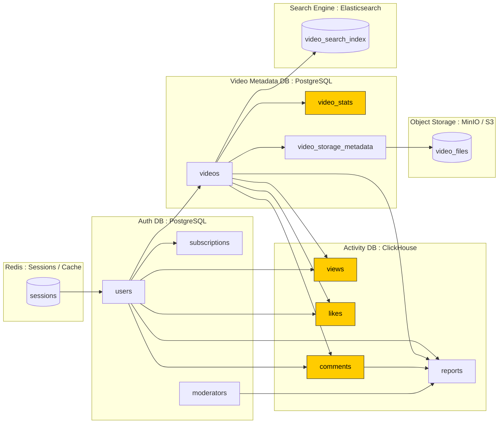
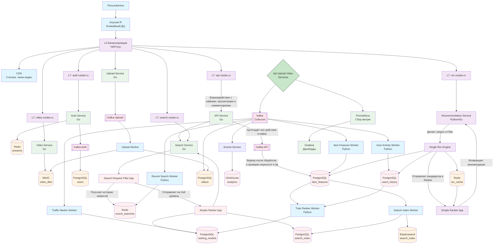

# VK-Education-Highload Курсовая работа
Шишкин А. Ю. WEB-41/31
# RUTUBE
## 1. Тема и Целевая Аудитория
**Тип сервиса**: Видеохостинг
**Местоположение целевой аудитории**: Россия и СНГ

### Основные страны пользователей
|Страна|% Пользователей|
|-|--------|
|Россия|93.3%|
|Казахстан|1.3%|
|Беларусь|1%|
|Украина|0.9%|
[Источник][3]

__Ключевой функционал__: Размещение видео

__Ключевое продуктовое решение__: Рекомендательная система видео

### MVP
* Авторизация
* Загрузка видео
* Просмотр видео (плеер)
* Просмотры и лайки
* Комментарии
* Админ-панель для модерации
* Рекомендации на главной 
* Поиск
* Главная Страница
* Страница автора

## 2. Расчёт нагрузки

### Предварительные данные
[**MAU**: 80M][1]

[**DAU**: 20M][1]

[4M каналов (зарегестрированных пользователей) всего][10]

**Средняя продолжительность визита: [46 минут][10]**

[**Средняя длина видео**: 12 минут][8]

3.8 Видео за посещение

[**Всего видео на площадке - 388М**][7]

1 минута видео весит 480мбит (0.48гб)(1080p, 30fps, 8Мбит/с битрейта).

Общий вес видео на рутубе на данный момент: 388М * 12 * 0.48 = **2 234 ПБ**

[421М Видео на площадке всего][5]

[33000М просмотров за полгода][5]

33000M / (6 * 30) = **183М / день** или **2К / секунда**

### RPS
| Тип запроса                                  |    Суточно  | Среднее RPS | Пиковое RPS (Среднее * 3) | Пояснение  |
| :------------------------------------------: | :-----------: | ----------: |        ----------:        | :----------:|
| **Просмотр видео**                           |          183M |         ~2K |          ~6K              |            |
| **Стриминг видео**                           |       131760M |       ~1.4M |          ~4.2M            | 2К запусков видео в секунду * 12*60 длительность видео в секундах, получается больно много, но по цифрам всё так будто |
| **Загрузка видео**                           |          370К |        ~4.3 |          ~13              | ~+135M видео за год => 135М/365 = 370K  |
| **Авторизация**                              |            4M |         ~47 |         ~141              | [4M каналов всего][10] |
| **Комментарии**                              |            1M |         ~12 |          ~36              | 1 коммент на 200 просмотров |
| **Главная Страница**                         |           20M |        ~231 |         ~696              | Каждый из DAU видит главную, хотя кто-то же заходит точечно по ссылке на видео... |
| **Профиль**                                  |           20K |        ~0.2 |         ~0.6              | В дальнейшем такие копейки игнорируем... |
| **Рекомендации**                             |          200M |       ~2.3K |          ~7K              | Каждый раз когда смотрят видео получают рекомендации + копейки с главной |
| **Лайки**                                    |            8M |         ~94 |         ~282              | 4 лайка на 100 просмотров |
| **Медиа (аватарки + превьюшки)**             |        2 745M |        ~32K |         ~96K              | На 1м экране просмотра видео умещается 8 рекомендованных видео, округлим до 10 и добавим 5 аватарок пользователей  |

### Трафик
| Тип трафика                                                           | Среднее (Гб/с) | Пиковое (Гб/c) | В сутки (ТБ) | Комментарий                      |
| --------------------------------------------------------------------- | -------------: | -------------: | ------------: | :------------------------------: |
| **Просмотр Видео**                                                    |            ~10 |            ~30 |      864     | 2000 видео/c * 0.005 мб          |
| **Стриминг Видео**                                                    |        ~10 400 |        ~31 200 |  624 000     | 1.4M RPS * 8мбит/c // чёт много              |
| **Загрузка Видео**                                                    |            ~25 |            ~75 |    6 480     | 4.3 * 12 мин * 0.48 гб/мин       |
| **Медиа**                                                             |            ~64 |           ~192 |   16 588     | 32K RPS * 2мб                    |
| **Итого**                                                             |      **~1507** |      **~4521** | **380 000**  |                                  |
 
### Хранилище
|Хранимый контент| Надо сейчас (ТБ) | Надо будет через год (ТБ) |Пояснение          |
|:--------------:|-----------------:|--------------------------:|:-----------------:|
|Видео           |        2 234 000 |                 3 041 280 | Чё так много то...|
|Медиа           |              850 |                      1190 |  4M * 2Мб (аватарки) + 421М * 2Мб (превьюхи) |
|Таблички (Просмотры, лайки, комменты)| | | Сущие копейки на фоне остального которые я даже не представляю как считать|

## 3. Глобальная балансировка нагрузки
### Функциональное разбиение по доменам
| Домен                                     | Назначение                                         |
| ----------------------------------------- | -------------------------------------------------- |
| **auth.rutube.ru**                        | Авторизация и управление сессиями                  |
| **upload.rutube.ru**                      | Загрузка видео и обработка                         |
| **video.rutube.ru**                       | Отдача видеопотока (плеер)                         |
| **api.rutube.ru**                         | Просмотры, лайки, комментарии, поиск, рекомендации |
| **admin.rutube.ru**                       | Админ-панель и модерация                           |
| **media.rutube.ru**                       | Превьюхи и аватарки                                |

### Обоснование расположения дата-центров

Москва — основной центр, большая часть аудитории в европейской части РФ.

Владивосток / Хабаровск — снижение задержек для Дальнего Востока.
### Расчет распределения запросов

### DNS

DNS-сервер не эффективен в пределах одной страны

### Anycast

Объявляем одинаковые ip в ДЦ Москвы и Дальнего востока, когда пользователь пытается подключиться к нашему сервису он подключается по ip, остальное дело за BGP который сам выберет ближайший к пользователю ДЦ

# 4. Локальная балансировка нагрузки (Rutube, 1 ДЦ)

## Исходные показатели

| Параметр | Значение |
|-----------|-----------|
| Пиковый трафик (видео) | **31 200 Gbit/s** |
| Пиковый трафик (API / статистика и прочее) | **300 Gbit/s** |
| Архитектура | **L4 (видео)** + **L7 (API, статистика, TLS)** |
| Политика резервирования | **N + 1** |
| Размещение | **все ноды в одном ДЦ** |

---

## Формулы расчёта

1. Количество нод по пропускной способности:  
   **LB_bw = Peak_Gbps / Throughput_per_node (округление вверх)**

2. Применение резервирования (N + 1):  
   **LB_final = LB_bw + 1**

---

## Расчёт для L4 (видеопоток)

| Показатель | Значение |
|-------------|-----------|
| Peak_Gbps_L4 | **31 200 Gbit/s** |
| Пропускная способность одной L4-ноды | **400 Gbit/s** |

LB_bw_L4 = 31 200 / 400 = 78  
LB_final_L4 = 78 + 1 = **79 нод**

**Итого (L4, единый ДЦ): 79 нод (все в одном ДЦ).**

---

## Расчёт для L7 (API / статистика / TLS)

| Показатель | Значение |
|-------------|-----------|
| Peak_Gbps_L7 | **300 Gbit/s** |
| Пропускная способность одной L7-ноды | **40 Gbit/s** |

LB_bw_L7 = 300 / 40 = 7.5 → 8 нод  
LB_final_L7 = 8 + 1 = **9 нод**

**Итого (L7, единый ДЦ): 9 нод (все в одном ДЦ).**

---

## Итоговая сводка (в одном ДЦ)

| Слой | Пиковая нагрузка | Пропускная способность ноды | Резервирование | Всего нод |
|------|------------------|-----------------------------|----------------|----------:|
| **L4 (видео)** | 31 200 Gbit/s | 400 Gbit/s | N+1 | **79** |
| **L7 (API, статистика)** | 300 Gbit/s | 40 Gbit/s | N+1 | **9** |

---

# 5. Логическая схема БД

# 6 Физическая схема БД

| Хранилище                   | Таблица / Индекс         | Назначение                                                                                 |
| --------------------------- | ------------------------ | ------------------------------------------------------------------------------------------ |
| **PostgreSQL (AuthDB)**     | `users`                  | Профили пользователей, авторизация, связь с сессиями                                       |
|                             | `subscriptions`          | Подписки на других пользователей                                                           |
|                             | `moderators`             | Роли и доступы модераторов                                                                 |
| **PostgreSQL (VideoDB)**    | `videos`                 | Метаданные видео (название, описание, ID владельца, дата загрузки, флаги модерации)        |
|                             | `video_stats`            | Счётчики лайков, просмотров и комментариев по видео (для ускоренного доступа)              |
|                             | `video_storage_metadata` | Служебные данные о хранении файлов в MinIO: путь, версия, формат, thumbnail                |
| **ClickHouse (ActivityDB)** | `views`                  | Подробные события просмотров (user_id, video_id, timestamp)                                |
|                             | `likes`                  | События лайков с точными временными метками                                                |
|                             | `comments`               | Комментарии и иерархия ответов                                                             |
|                             | `reports`                | Репорты на контент или пользователей                                                       |
| **Redis**                   | `sessions`               | Авторизационные токены / refresh-токены / CSRF-защита / TTL                                |
| **MinIO (S3 совместимое)**  | `video_files`            | Файлы видео, превью, thumbnails — хранятся по UUID                                         |
| **Elasticsearch**           | `video_search_index`     | Полнотекстовый индекс: названия, описания, теги, имена авторов (для поиска и рекомендаций) |

## Индексы

### PostgreSQL
| Таблица         | Индекс                              | Тип   |
| --------------- | ----------------------------------- | ----- |
| `users`         | `email`, `username`                 | BTREE |
| `videos`        | `upload_date`                       | BTREE |
| `video_stats`   | `video_id`                          | BTREE |
| `subscriptions` | `(subscriber_id, subscribed_to_id)` | BTREE |

### Clickhouse
| Таблица    | PRIMARY KEY              | ORDER BY                 |
| ---------- | ------------------------ | ------------------------ |
| `views`    | `(video_id, user_id)`    | `(video_id, view_date)`  |
| `likes`    | `(video_id, user_id)`    | `(video_id, created_at)` |
| `comments` | `(video_id, created_at)` | `(video_id, created_at)` |
| `reports`  | `(video_id, created_at)` | `(video_id, created_at)` |

### Elasticsearch
| Индекс               | Поля                                          | Назначение                          |
| -------------------- | --------------------------------------------- | ----------------------------------- |
| `video_search_index` | `title`, `description`, `tags`, `author_name` | Полнотекстовый поиск и рекомендации |

## Денормализация
| Таблица                  | Денормализованные поля                         | Причина                                  |
| ------------------------ | ---------------------------------------------- | ---------------------------------------- |
| `video_stats`            | `total_views`, `total_likes`                   | Быстрые выборки без агрегации            |
| `views` / `likes`        | `video_id`, `user_id`                          | Упрощение JOIN-ов в ClickHouse           |
| `comments`               | `parent_comment_id`                            | Быстрая иерархия комментариев            |
| `video_storage_metadata` | `bucket`, `object_key`, `resolution`, `format` | Быстрый доступ к файлам без JOIN с MinIO |

## Выбор БД

| Назначение                    | СУБД              | Причина выбора                     |
| ----------------------------- | ----------------- | ---------------------------------- |
| Пользователи, метаданные      | **PostgreSQL**    | ACID, транзакции                   |
| Активность (просмотры, лайки) | **ClickHouse**    | Аналитика и real-time              |
| Видео-файлы                   | **MinIO (S3)**    | Масштабируемое объектное хранилище |
| Сессии / кеш                  | **Redis Cluster** | In-memory, TTL                     |
| Поиск                         | **Elasticsearch** | Быстрый полнотекстовый поиск       |

## Шардирование
| Компонент                 | Метод шардинга                     | Репликация / резервирование   |
| ------------------------- | ---------------------------------- | ----------------------------- |
| PostgreSQL (Auth / Video) | Hash по `user_id` или `video_id`   | Master + 2 replicas (async)   |
| ClickHouse                | Distributed table по `video_id`    | ReplicatedMergeTree (2 копии) |
| Redis                     | А он тут нужен?                    | Cluster mode + Sentinel       |
| MinIO                     | Erasure coding + replication       | 4–8 нод, 2 parity блока       |
| Elasticsearch             | Shards по `video_id` + replica     | primary + replica shards      |

## Клиентские библиотеки и интеграции
| Компонент         | Клиент (Go)                   | Заметки                  |
| ----------------- | ----------------------------- | ------------------------ |
| PostgreSQL        | `pgx`                         | connection pooling       |
| ClickHouse        | `clickhouse-go/v2`            | async вставка батчами    |
| Redis             | `go-redis/v9`                 | для сессий и кеша        |
| MinIO             | `minio-go/v7`                 | multipart upload         |
| Elastic           | `elastic/go-elasticsearch/v8` | если нужен внешний поиск |

## Резервное копирование
| Компонент           | Метод                | Частота                | Хранение           |
| ------------------- | -------------------- | ---------------------- | ------------------ |
| PostgreSQL          | `pg_dump` + WAL      | каждые 6 ч (инкремент) | S3 / MinIO         |
| ClickHouse          | `BACKUP TABLE` → S3  | 1 раз в сутки          | S3 snapshot        |
| MinIO               | Snapshot replication | раз в сутки            | отдельный кластер  |
| Конфиги (YAML, env) | Git + S3 backup      | при деплое             | Git / S3           |

# 7. Алгоритмы

## 7.1. Алгоритм адаптивного стриминга (HLS/DASH)

**Область применения:** Просмотр видео

**Назначение:** Обеспечение плавного просмотра при различном качестве интернет-соединения пользователя.

**Принцип работы:**

### Подготовка контента:
- Видео заранее кодируется в несколько качеств (1080p, 720p, 480p, 360p)
- Каждая версия нарезается на короткие чанки продолжительностью 2-10 секунд
- Формируется манифест-файл с информацией о всех доступных чанках и их качестве

### Инициализация просмотра:
- Плеер загружает манифест и начинает воспроизведение со среднего качества
- Одновременно оценивается скорость сети и стабильность соединения

### Динамическая адаптация:
- Алгоритм постоянно мониторит:
  - Скорость загрузки чанков
  - Уровень заполнения буфера воспроизведения
  - Частоту потерь пакетов
- На основе этих метрик выбирает оптимальное качество для следующего чанка
- При ухудшении связи - переключается на более низкое качество
- При улучшении - постепенно повышает качество

## 7.2. Алгоритм автоматического анализа видеоконтента

**Пайплайн обработки:**
1. **Поступление видео** → Upload Service кладет видео в MinIO и отправляет событие в Kafka Upload
2. **Очередь обработки** → Video Service получает событие, создает задачу в Kafka Video
3. **Воркеры анализа** → 
   - Компьютерное зрение: YOLOv8 (объекты), CLIP (сцены), OCR (текст)
   - Аудиоанализ: Whisper (транскрипция), YAMNet (звуки)
   - Текст: BERT (теги), CatBoost (категории)
4. **Обогащение метаданных** → результаты пишутся в PostgreSQL videos через Kafka
5. **Индексация для поиска** → Search Index Worker обновляет Elasticsearch

**Результат:** автоматические теги, категории, транскрипты для поиска и рекомендаций

---

## 7.3. Алгоритм персонализированных рекомендаций

**Двухуровневая архитектура:**

**Level 1 - Кандидаты:**
- API Service → Recommendation Service → Single Rec Engine
- Источники кандидатов:
  - Content-based: похожие видео (Item Features DB)
  - Collaborative: похожие пользователи (Users History DB) 
  - Trending: популярное (Redis rec_cache)
  - Fresh: новое (PostgreSQL videos)

**Level 2 - Ранжирование:**
- Single Rec Engine → Simple Ranker App
- Модели: Two-Tower (семантика), DeepFM (признаки), ALS (коллаборация)
- Контекст: история пользователя, время, устройство

**Обучение моделей:**
- User Activity Worker → Users History DB
- Train Ranker Worker обучает модели → Ranking Models DB

---

## 7.4. Алгоритм полнотекстового поиска

**Поисковый пайплайн:**

**Индексация:**
1. Video Service/Upload Service → Kafka → Search Index Worker
2. Данные для индекса:
   - Базовые метаданные (название, описание)
   - Автоматические теги (из анализа контента)
   - Транскрипты речи (Whisper)
   - Визуальные признаки (CLIP)
3. Индекс: Elasticsearch + PostgreSQL search_index

**Поисковый запрос:**
1. Пользователь → L7 search → Search Service
2. Request Filler обогащает запрос (история из Redis)
3. Search App ищет кандидатов (Elasticsearch + PostgreSQL)
4. Simple Ranker ранжирует (модели из Ranking Models DB)

**Модели поиска:**
- Текст: BM25 + Sentence-BERT
- Визуал: CLIP эмбеддинги
- Ранжирование: LambdaMART
## 7.5. Алгоритм сегментации и кодирования видео

**Область применения:** Обработка загружаемых видео

**Назначение:** Подготовка видеофайлов к эффективному хранению и адаптивному стримингу.

**Принцип работы:**

### Прием загрузки:
- Пользователь загружает видеофайл
- Файл проверяется на безопасность и валидность
- Видео помещается в очередь обработки

### Параллельная обработка:
- **Кодирование в multiple bitrate:** создание версий разного качества
- **Контент-анализ:** запуск алгоритма автоматического анализа видеоконтента
- Обе процессы выполняются параллельно для ускорения обработки

### Сегментация на чанки:
- Каждая версия качества нарезается на сегменты по 2-10 секунд
- Формируются плейлисты и манифесты для адаптивного стриминга

### Синхронизация метаданных:
- Результаты контент-анализа сохраняются в базу данных
- Обновляются поисковые индексы
- Видео становится доступным для поиска и рекомендаций
# 8 Технологии

| Технология | Область применения | Обоснование выбора |
|------------|-------------------|-------------------|
| **Go (Golang)** | Бэкенд-сервисы, API | Высокая производительность, простота разработки микросервисов, эффективное потребление ресурсов |
| **Nginx** | Балансировщик нагрузки (L7), раздача статики | Высокая производительность, гибкая конфигурация, проверенная надежность |
| **Docker, Kubernetes** | Контейнеризация, оркестрация | Изоляция сервисов, масштабируемость, упрощение деплоя |
| **Apache Kafka** | Очереди событий, стриминг данных | Высокая пропускная способность, отказоустойчивость, гарантированная доставка сообщений |
| **Grafana + Prometheus** | Мониторинг и визуализация | Мониторинг метрик в реальном времени, гибкие дашборды, оповещения |
| **HAProxy** | Балансировщик нагрузки (L4) | Эффективная балансировка TCP-трафика, стабильность, мониторинг |
| **FFmpeg** | Обработка видео | Промышленный стандарт для кодирования/декодирования видео, поддержка всех форматов |
| **hls.js** | Клиентский плеер (браузер) | Библиотеки для адаптивного стриминга в браузере, поддержка HLS/DASH |
| **Jaeger** | Распределенный трейсинг | Отслеживание запросов в микросервисной архитектуре, диагностика проблем |  
| **ArgoCD** | GitOps деплой | Автоматизация деплоя приложений, синхронизация с git-репозиторием |

# 10 Схема проекта

# 11

## RPS по сервисам

| Сервис | Средний RPS | Пиковый RPS |
|--------|-------------|-------------|
| Auth Service | 1,155 | 3,465 |
| Video Service | 2,117 | 6,351 |
| API Service | 2,315 | 6,945 |
| Recommendation Service | 2,315 | 6,945 |
| Search Service | 231 | 693 |
| Upload Service | 4.3 | 13 |
| Итого | 8,137 | 24,412 |

## Ресурсы микросервисов (Go)

| Сервис | CPU (cores) | RAM (GB) | Replicas |
|--------|-------------|----------|----------|
| Auth Service | 6.9 | 13.8 | 7 |
| Video Service | 12.7 | 25.4 | 13 |
| API Service | 13.9 | 27.8 | 14 |
| Recommendation Service | 13.9 | 27.8 | 14 |
| Search Service | 1.4 | 2.8 | 2 |
| Upload Service | 0.03 | 0.06 | 1 |
| Итого | 48.8 | 97.7 | 51 |

## Базы данных

### PostgreSQL
- Нагрузка: 30,000 QPS
- Серверов: 12
- CPU: 180 ядер (15 ядер на сервер)
- RAM: 3 ТБ (256 ГБ на сервер)

### Redis
- Нагрузка: 300,000 QPS  
- Серверов: 8
- CPU: 16 ядер (2 ядра на сервер)
- RAM: 256 ГБ (32 ГБ на сервер)

### ClickHouse
- Нагрузка: 3,000 QPS
- Серверов: 4
- CPU: 32 ядер (8 ядер на сервер)
- RAM: 256 ГБ (64 ГБ на сервер)

### Elasticsearch
- Нагрузка: 693 RPS
- Серверов: 6
- CPU: 48 ядер (8 ядер на сервер)
- RAM: 192 ГБ (32 ГБ на сервер)

## Очереди и воркеры

### Kafka
- Брокеров: 8 серверов
- Нагрузка: 10,000 RPS
- CPU: 48 ядер (6 ядер на брокер)
- RAM: 256 ГБ (32 ГБ на брокер)

### Workers
| Worker | Нагрузка | CPU | RAM | Replicas |
|--------|----------|-----|-----|----------|
| Item Features Worker | 3,000 RPS | 15 | 30 GB | 6 |
| User Activity Worker | 4,500 RPS | 22.5 | 45 GB | 9 |
| Recent Search Worker | 346 RPS | 1.7 | 3.5 GB | 2 |
| Traffic Marker Worker | 1,500 RPS | 7.5 | 15 GB | 3 |
| Search Index Worker | 750 RPS | 3.8 | 7.5 GB | 2 |
| Train Ranker Worker | 300 RPS | 3 | 12 GB | 1 |
| Итого | 10,396 RPS | 53.5 | 113 GB | 23 |

## Хранилище (MinIO)

| Параметр | Значение |
|----------|----------|
| Серверов | 48 |
| Текущий объём | 2,234 ПБ |
| Чтение QPS | 1.43 млн |
| CPU | 286 ядер (6 ядер на сервер) |
| RAM | 1.5 ТБ (32 ГБ на сервер) |

## GPU кластер

| Назначение | GPU Тип | Серверы | CPU | RAM | VRAM |
|------------|---------|---------|-----|-----|------|
| Транскрибация | A100 80GB | 6 | 96 ядер | 768 ГБ | 960 ГБ |
| Компьютерное зрение | RTX 4090 | 4 | 64 ядер | 512 ГБ | 192 ГБ |
| Эмбеддинги | A100 40GB | 3 | 48 ядер | 384 ГБ | 240 ГБ |
| Итого | | 13 | 208 ядер | 1.66 ТБ | 1.392 ТБ |

## Итоговая инфраструктура

| Компонент | Серверы | Всего CPU | Всего RAM |
|-----------|---------|-----------|-----------|
| Kubenodes | 18 | 576 ядер | 2.3 ТБ |
| PostgreSQL | 12 | 180 ядер | 3 ТБ |
| Redis | 8 | 16 ядер | 256 ГБ |
| Kafka | 8 | 48 ядер | 256 ГБ |
| ClickHouse | 4 | 32 ядер | 256 ГБ |
| Elasticsearch | 6 | 48 ядер | 192 ГБ |
| MinIO | 48 | 288 ядер | 1.5 ТБ |
| GPU серверы | 13 | 208 ядер | 1.66 ТБ |
| Всего | 117 | 1,396 ядер | ~9.2 ТБ |

## Стоимость инфраструктуры

| Компонент | Стоимость/мес |
|-----------|---------------|
| Kubenodes (18 × $800) | $14,400 |
| Базы данных (30 × $600) | $18,000 |
| Kafka (8 × $500) | $4,000 |
| MinIO (48 × $400) | $19,200 |
| GPU (13 × $2,400) | $31,200 |
| CDN/Сеть | $10,000 |
| Итого | $96,800/месяц |

[1]: https://tass.ru/ekonomika/24311321 "Источник"
[2]: https://inclient.ru/rutube-stats/#rutube3 "Не уверен верить ли источнику"
[3]: https://www.similarweb.com/ru/website/rutube.ru/#demographics "Трафик по странам"
[5]: https://www.cnews.ru/news/line/2025-09-04_dnevnaya_auditoriya_rutube_vyrosla "Последняя статистика по рутубу"
[6]: https://affmaven.com/ru/youtube-statistics/ "Табличка статистики рутуба которую можем спроецировать на рутуб"
[7]: https://habr.com/ru/news/896842/ "388кк видео на рутубе"
[8]: ... "Источника нет, предположение нейронки"
[9]: https://skillbox.ru/media/marketing/mediascope-opublikovala-issledovanie-auditorii-sotsialnykh-media-youtube-poka-eshchye-lider/ "Инфа от медиаскоупа"
[10]: https://habr.com/ru/news/926262/
